# EduEvolveAI

Introducing EduEvolveAI, the ultimate student companion. A platform for efficient productivity tracking, multilingual assistance, and engaging in insightful content discussions with our intelligent our all-in-one solution for efficient learning.

## Personalized Virtual Classrooms for India

India's education system faces challenges like overburdened teachers, disparities in access to quality education, and high student-teacher ratios. These obstacles lead to lower teaching quality and reduced teacher-student interaction.

Personalized virtual classrooms for sustainable development offer a promising solution by leveraging technology to:

- Cater to diverse learning needs
- Ensure access to educational resources
- Relieve teachers of routine tasks

By implementing these virtual environments, India can bridge educational gaps, create an equitable learning ecosystem, and revolutionize education delivery.

This project examines the rationale and potential of personalized learning in transforming Indian education.

## Solution Model
- This is the main page
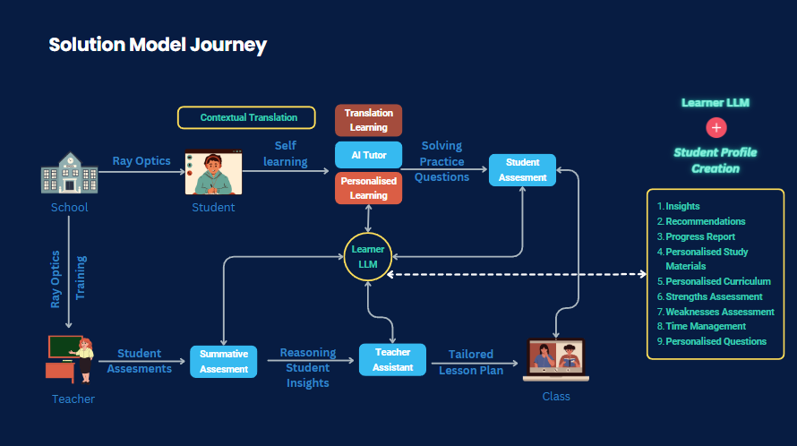

## Key Features

### Student Profile 
- Transforms raw data into detailed student profiles
- Provides insights for personalized support

### Notes Creator
- Summarizes lengthy videos and materials into concise notes
- Facilitates quick comprehension and retention

### Talk to Notes
- Natural language interaction with study materials
- Enables learning, comprehension, and doubt clarification

### Flash Cards 
- Converts PDFs and text files into interactive flash cards
- Aids effective revision and comprehension

### Contextual Summarizers
- Condenses extensive texts (PDFs, PPTs, books) into summaries
- Optimizes learning efficiency

### Assessment Tool
- Enables teachers to create quizzes swiftly
- Supports various formats (true/false, open-ended, multiple-choice)

### Glossary Generator
- Extracts significant terms and definitions
- Ensures access to essential information

### Lesson Plan Generator
- Creates personalized learning paths
- Tailors educational experience based on student profiles

### Personalized Learning Assessment
- Generates targeted feedback and questions
- Addresses weaknesses and challenges strengths

### Student Data Analytics
- Comprehensive analysis of strengths, weaknesses, growth
- Supports data-driven, personalized learning strategies

### Contextual Translation
- Translates educational content into diverse languages
- Enhances accessibility and comprehension


## Tech Stack


Then install the following libraries
python
Python libries
 -langchain
- flask
- gradio
- spacy
- PyPDF2
- pandas
- sys
- fuzzywuzzy

Here are the list of the APIs Used:

1. OpenAI API
2. Langchain
3. Google GenerativeAI API (Gemini)
4. googletrans
5. gtts (Google Text-to-Speech)
6. googleapiclient.discovery
7. youtube_transcript_api

## Authors

- [@SriBharathSharma](https://github.com/codekid211)
- [@SayliJain](https://github.com/SayliJain)
- [@RatanRavichandran](https://github.com/RatanRavichandran)
- [@HarshithJ](https://github.com/HarshReddy10)


## Screenshots
### Main page
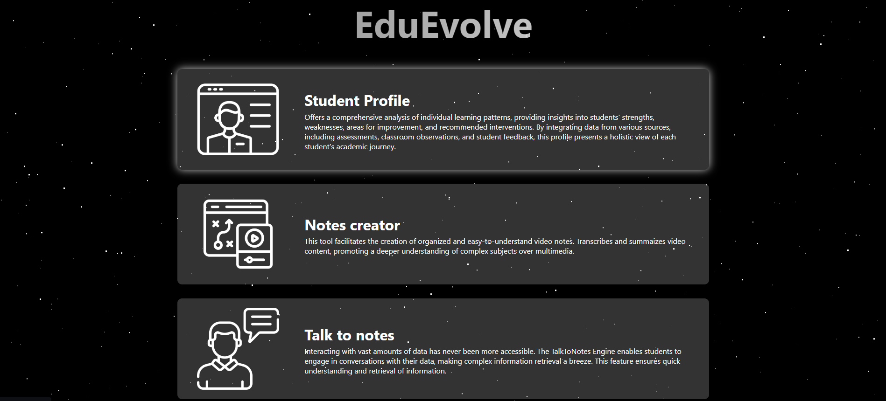

### Student Profile Enhancer
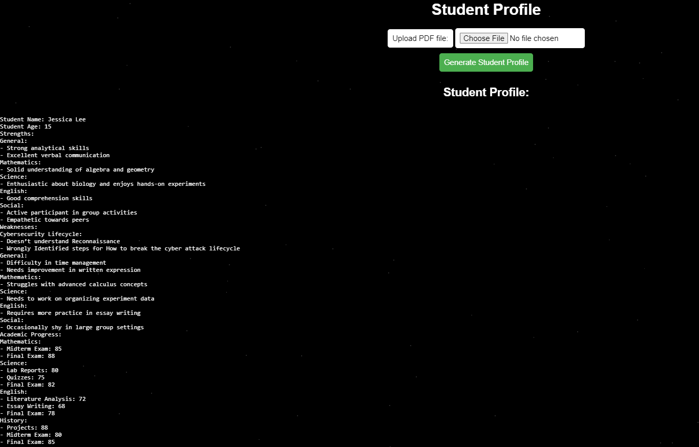

### Notes Creator
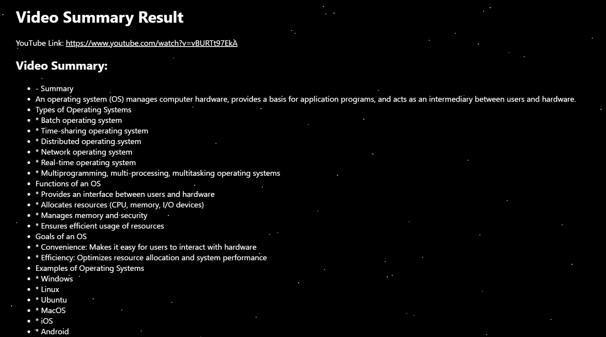

### Talk to Notes
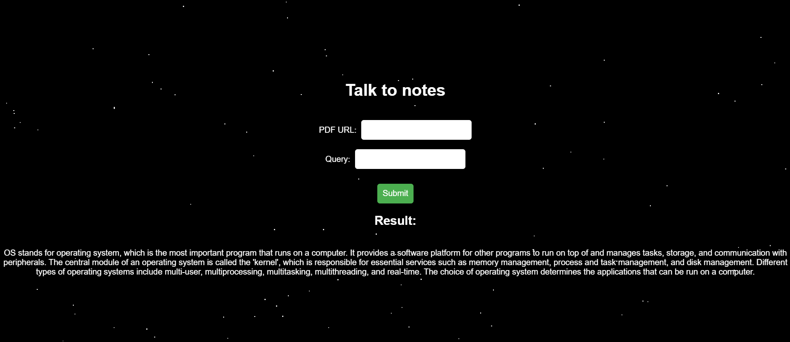

### Flash Card Converter
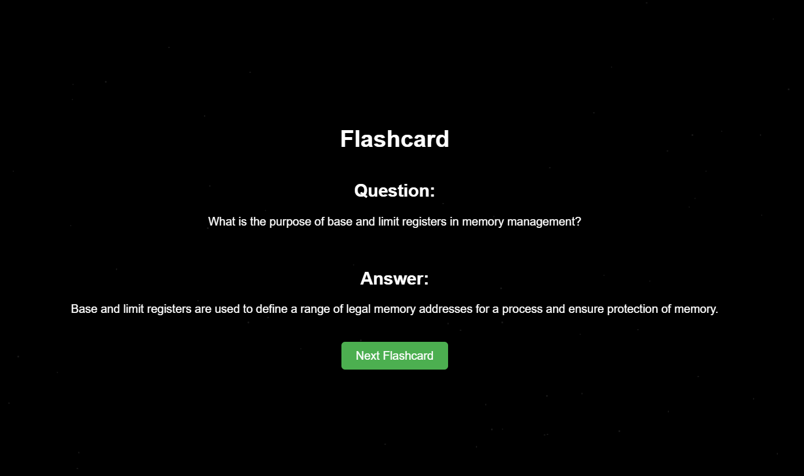

### Contextual Summarizers
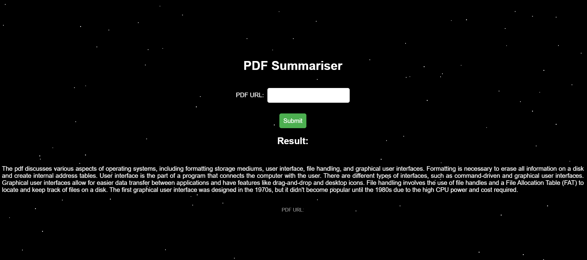

### Assessment Tool
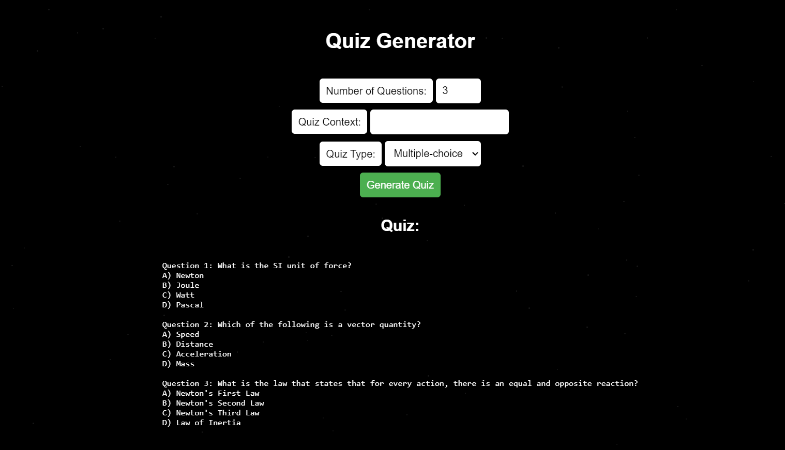

### Glossary Generator
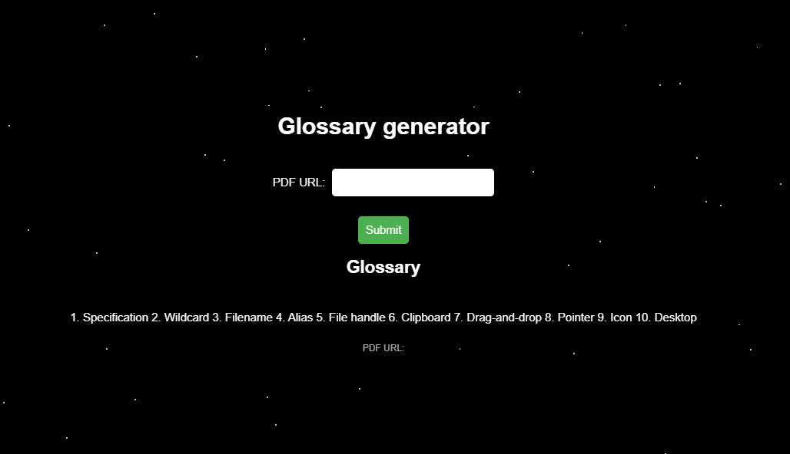

### Lesson Plan Generator
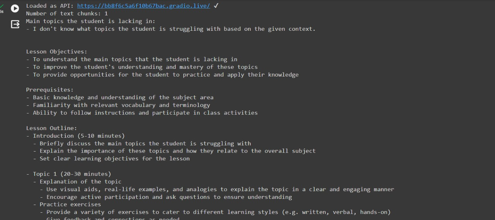

### Personalized Learning Assessment
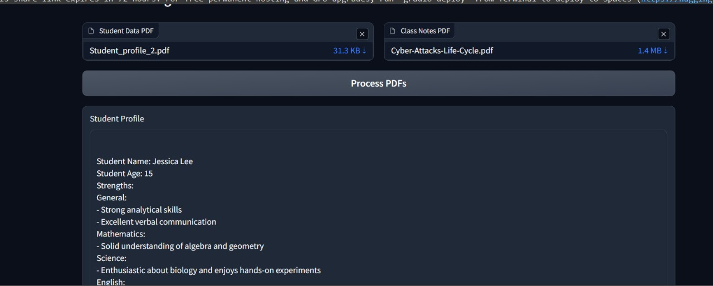
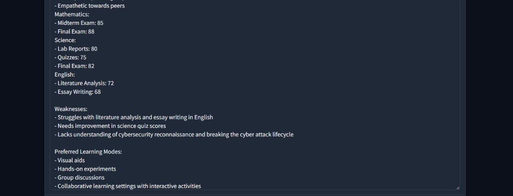

### Student Data Analytics
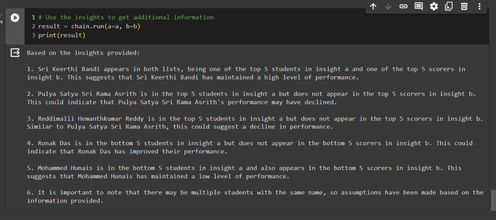

### Contextual Translation
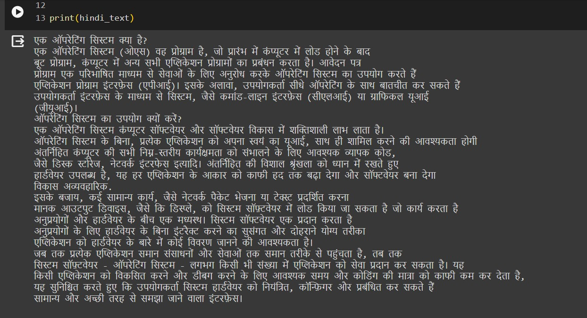
```


